# ClickUp Clone

A full-stack, ClickUp-style work management app: spaces, lists and tasks viewed as a Board, List, Table, Calendar or Gantt Timeline, with a rich task panel, comments, docs, dashboards, automations, time tracking and Claude AI. Built as a pnpm + Turborepo monorepo with a Next.js front end, an Express + Prisma API and a shared zod schema package.

[](https://github.com/alysalah83/Click-up-clone/actions/workflows/ci.yml)

**[Try the live demo →](https://click-up-clone-two.vercel.app)** One click, no sign-up: you get a private, pre-filled workspace with six teammates, ~80 tasks, docs, comments and notifications.

<p align="center">
  <a href="https://click-up-clone-two.vercel.app">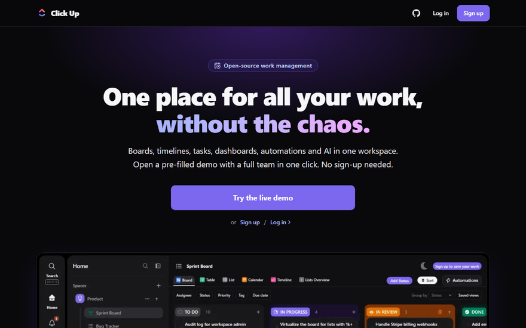</a>
</p>

## Screenshots

<table>
  <tr>
    <td align="center" width="50%">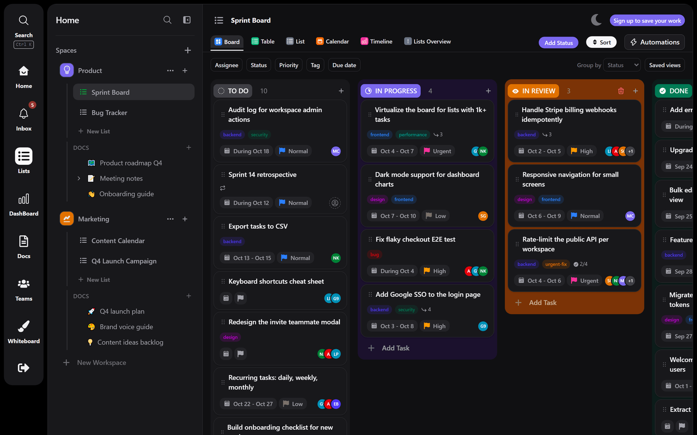<br><strong>Board</strong>: drag across custom statuses, filters, group by, saved views</td>
    <td align="center" width="50%">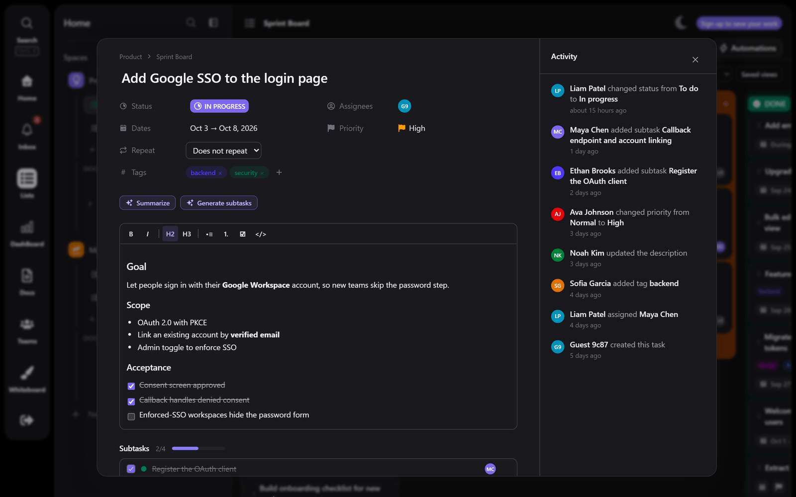<br><strong>Task panel</strong>: rich text, subtasks, checklists, tags, comments, activity, AI</td>
  </tr>
  <tr>
    <td align="center">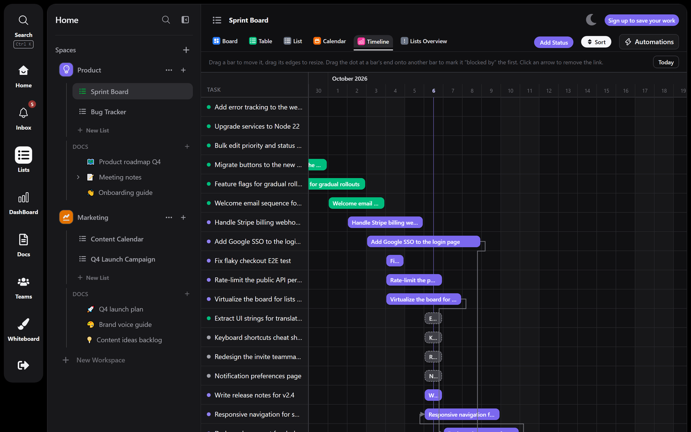<br><strong>Timeline</strong>: Gantt with drag-to-reschedule and dependencies</td>
    <td align="center">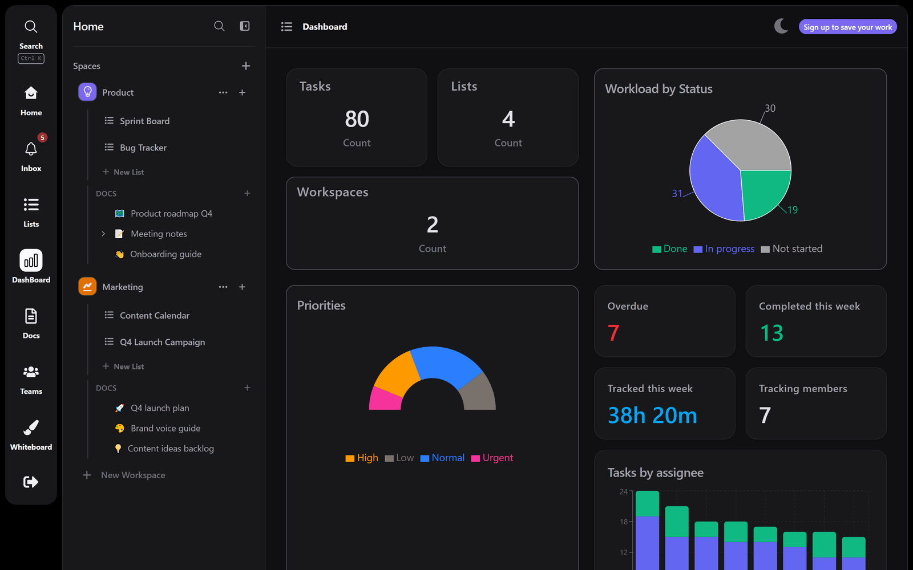<br><strong>Dashboard</strong>: workload, overdue, burndown, time tracked</td>
  </tr>
  <tr>
    <td align="center">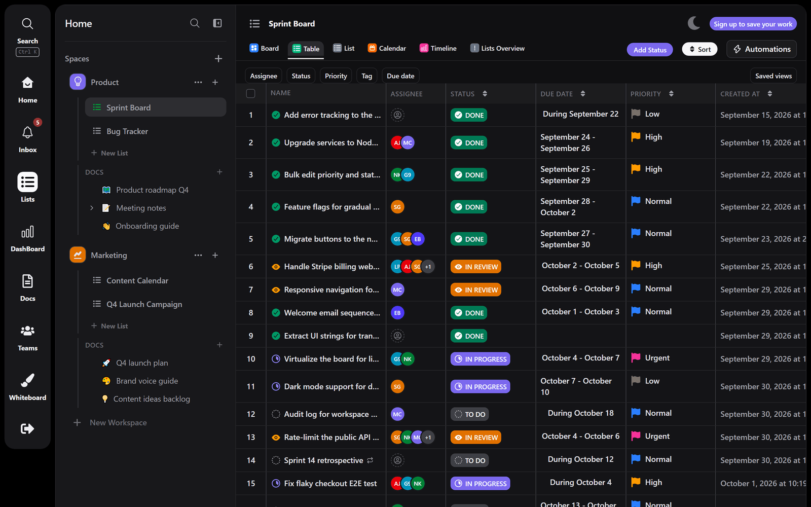<br><strong>Table</strong> with bulk edit</td>
    <td align="center">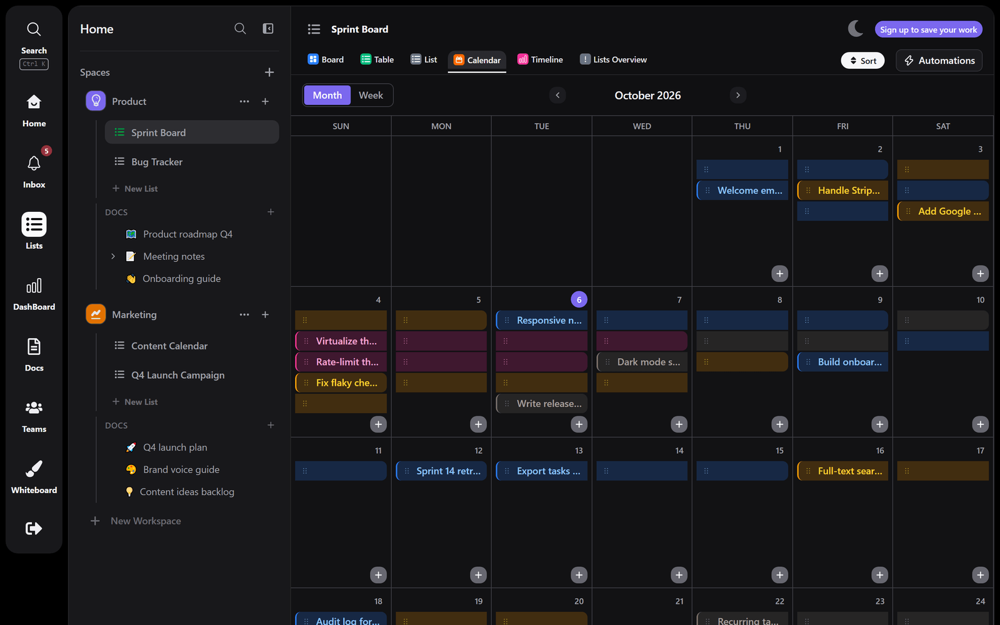<br><strong>Calendar</strong>: month and week, drag to reschedule</td>
  </tr>
  <tr>
    <td align="center">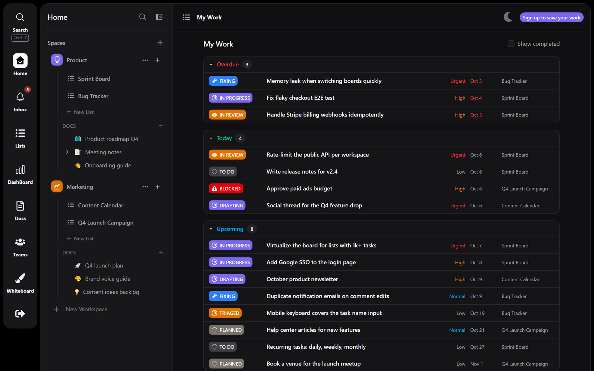<br><strong>My Work</strong>: overdue, today, upcoming</td>
    <td align="center">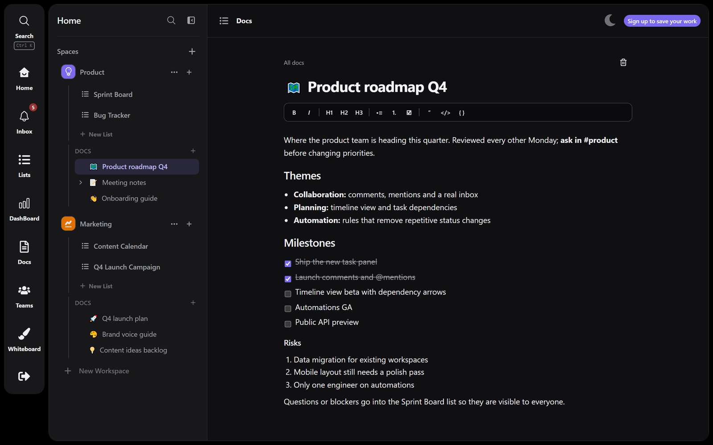<br><strong>Docs</strong>: nested pages per space</td>
  </tr>
  <tr>
    <td align="center">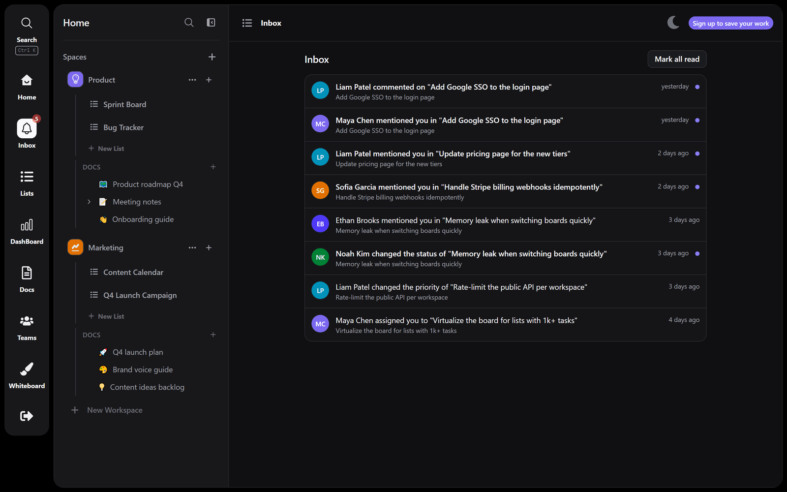<br><strong>Inbox</strong>: mentions, assignments, status changes</td>
    <td align="center">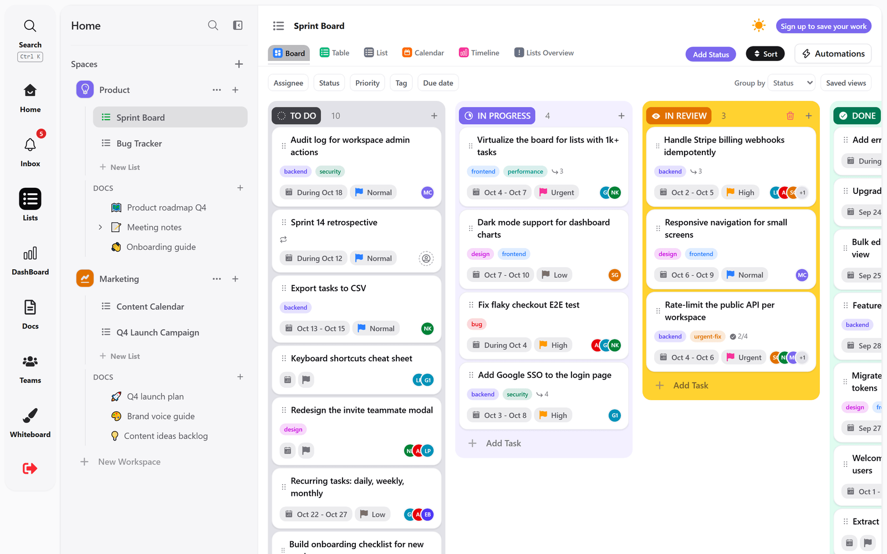<br><strong>Light theme</strong></td>
  </tr>
</table>

<p align="center">
  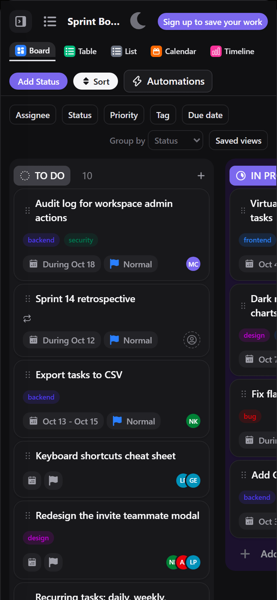
  &nbsp;&nbsp;
  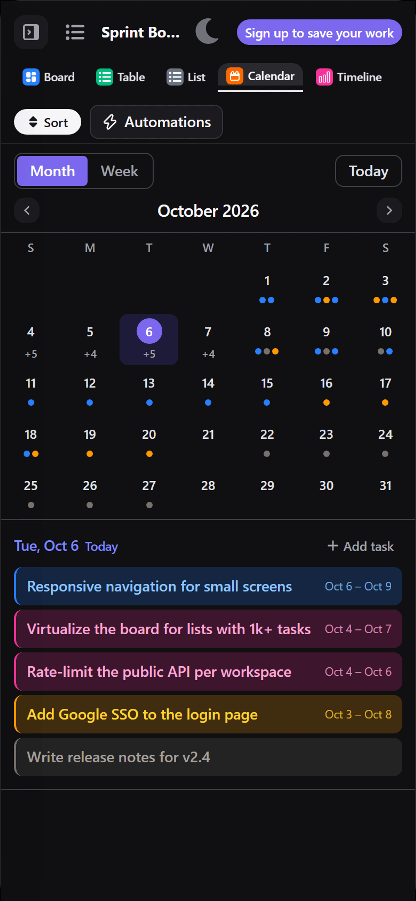
  <br><strong>Phone layout</strong>: sidebar drawer, snap-scroll board, compact calendar
</p>

## Features

- **Views:** Board, List, Table, Calendar (month/week) and Timeline (Gantt) over the same tasks; drag and drop on Board, Calendar and Timeline.
- **Tasks:** custom statuses per list, priorities, dates, assignees, Tiptap rich-text descriptions, subtasks, checklists, colored tags, "blocked by" dependencies, recurring tasks, activity log.
- **Collaboration:** workspace members and roles, invite links, threaded comments with @mentions and emoji reactions, Inbox with unread badge (polling, no WebSockets), My Work.
- **Organize:** filters, group by and saved views with a default per list; Ctrl+K command palette across tasks, lists, docs and members.
- **Automate and measure:** per-list automation rules (trigger, condition, action), time tracking with a live timer, dashboards with workload, overdue, completed this week and burndown.
- **Docs and whiteboard:** nested pages per space with autosave; an Excalidraw whiteboard.
- **AI:** Claude summarizes a task or generates subtasks from it.
- **Polish:** dark and light themes, phone layout, accessible Radix/shadcn menus and dialogs, instant guest demo from a pre-seeded account pool.

## Architecture

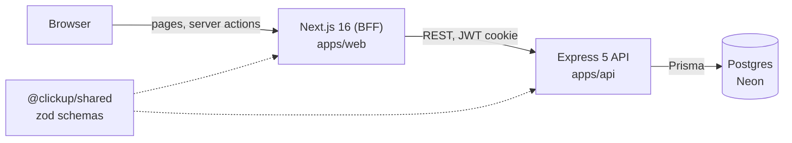

The browser talks only to Next.js. Server actions and server-side fetches forward requests to the Express API, which is the only thing that touches the database. Request schemas live in `@clickup/shared`, so client and server validation cannot drift apart.

```
apps/web         Next.js 16 (App Router), React 19, Tailwind, shadcn/ui (Radix)
apps/api         Express 5, Prisma 7, PostgreSQL
packages/shared  zod schemas and types shared by both apps
docs/            roadmap and architecture decision records
```

Key technologies: TypeScript, TanStack Query, Zustand, shadcn/ui, React Hook Form + zod, dnd-kit, Tiptap, Recharts, Excalidraw, Claude API, Vitest, Playwright, GitHub Actions, Vercel (web and API) and Neon (Postgres).

## Engineering highlights

- **Layered API with validation and ownership checks.** Routes, `validate()` (zod), controllers, services. Unknown keys are stripped, and every ID in a request goes through a single `assertCanAccess()` that returns 404 for both missing and not-owned resources. See [ADR 0003](docs/adr/0003-api-layering-and-validation.md).
- **Cross-account tests.** API integration tests run against a real Postgres and check that one user cannot read or modify another user's resources.
- **Migrations applied on deploy.** The API's Vercel build runs Prisma migrations, so schema and code ship together.
- **Instant guest demo.** Seeding a demo workspace is ~25 batched writes, which takes seconds on serverless Postgres. The API keeps a small pool of pre-seeded guests: "Try the live demo" claims one with a single `FOR UPDATE SKIP LOCKED` statement that also shifts its seeded dates to today, and a replacement is seeded after the response is sent.
- **Guest hygiene.** Guest sign-ups are rate-limited, and a scheduled cron endpoint removes stale guest accounts.
- **Accessible UI on Radix, behind stable APIs.** The original hand-built menu, modal and tooltip library lacked focus handling and Escape-to-close. They were re-implemented on Radix primitives with unchanged component APIs, so about 60 call sites did not change. The original implementations are kept as a showcase in `apps/web/src/legacy-ui` (dev-only `/legacy-ui` route). See [ADR 0002](docs/adr/0002-adopt-shadcn-ui.md).
- **Monorepo.** One repo, one CI run, atomic cross-app changes. See [ADR 0001](docs/adr/0001-monorepo.md).
- **Tests at three levels.** Web unit and component tests (Vitest, Testing Library), API integration tests (Vitest against Postgres), and a Playwright end-to-end test of the guest demo path: seeded board, drag a card between board columns, open and close task details, bulk-set priority in the table, calendar view, sign out.
- **CI.** GitHub Actions runs lint, typecheck, tests and build with a Postgres service container, then a separate job runs the Playwright test against production builds and uploads the report on failure.

## Local development

Requires Node 22+ and pnpm.

```bash
pnpm install
pnpm --filter @clickup/api db:local            # embedded Postgres on :54329 (no Docker needed)
cp apps/api/.env.example apps/api/.env         # defaults point at the local database
pnpm --filter @clickup/api exec prisma migrate deploy
pnpm --filter @clickup/shared build
pnpm --filter @clickup/api dev                 # API on http://localhost:5000
```

In a second terminal, set up and start the web app (`JWT_SECRET` must match the API's):

```bash
cp apps/web/.env.example apps/web/.env.local   # API_URL=http://localhost:5000/api
pnpm --filter @clickup/web dev                 # http://localhost:3000
```

Checks:

```bash
pnpm lint && pnpm typecheck && pnpm test       # API tests boot their own Postgres on :54330
pnpm --filter @clickup/web test:e2e            # Playwright starts the API + web dev servers itself (reuses running ones); needs the migrated DB (pnpm --filter @clickup/api db:local) and a one-time `playwright install chromium`
```

## Project evolution

- **v1:** two repositories (Next.js front end, Express API), a hand-built UI component library, and a backend migration from MongoDB to PostgreSQL along the way.
- **v2 (this repo):** a single monorepo, a hardened and tested API (validation, ownership checks, status types, rate limits), overlays rebuilt on Radix for accessibility, bug fixes across the four views, CI, and an end-to-end test.
- **v3:** a collaboration core (members, roles, invites, assignees, comments, inbox), a rich task panel, Timeline, saved views, automations, dashboards, time tracking, recurring tasks, docs, Claude AI, a phone layout and a seeded one-click demo.

## Screenshots and demo GIF

`node apps/web/scripts/capture-screenshots.mjs` re-captures the landing images, these screenshots, the demo GIF and the Open Graph card from the live guest demo (Playwright + sharp).

## Roadmap

Real-time collaboration is deliberately deferred while the project stays on free hosting (Vercel + Neon, no WebSockets). Ideas and later phases are in [docs/roadmap.md](docs/roadmap.md).
