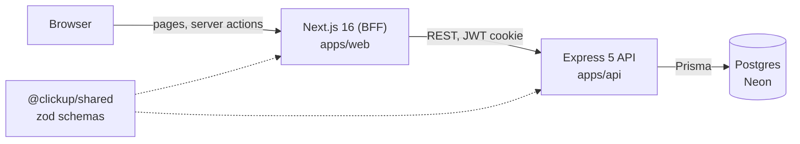

# ClickUp Clone

A full-stack project management app inspired by ClickUp: workspaces, lists, custom statuses and tasks, viewable as a Board, List, Table or Calendar. Built as a pnpm + Turborepo monorepo with a Next.js front end, an Express + Prisma API and a shared zod schema package.

[](https://github.com/alysalah83/Click-up-clone/actions/workflows/ci.yml)

**[Try the guest demo](https://click-up-clone-two.vercel.app)** (no sign-up: "Continue as guest" gives you a private throwaway account).

## Screenshots

<div align="center">
  <table>
    <tr>
      <td align="center"><br><strong>Home</strong></td>
      <td align="center"><br><strong>Login and guest entry</strong></td>
      <td align="center"><br><strong>Onboarding wizard</strong></td>
      <td align="center"><br><strong>Dashboard</strong></td>
    </tr>
    <tr>
      <td align="center"><br><strong>Board</strong></td>
      <td align="center"><br><strong>List</strong></td>
      <td align="center"><br><strong>Table</strong></td>
      <td align="center"><br><strong>Calendar (month)</strong></td>
    </tr>
    <tr>
      <td align="center"><br><strong>Calendar (week)</strong></td>
      <td align="center"><br><strong>Whiteboard</strong></td>
      <td align="center"><br><strong>Light theme</strong></td>
      <td align="center"><br><strong>Icon and color picker</strong></td>
    </tr>
  </table>
</div>

## Features

| Feature | Status |
| --- | --- |
| Workspace, List, Status, Task hierarchy, with icon and color per workspace | Built |
| Board, List, Table and Calendar views over the same task data | Built |
| Drag and drop (Board columns, Calendar days) | Built |
| Sorting by status, priority, due date or created date | Built |
| Bulk edit in Table view (status, priority, dates, delete) | Built |
| Onboarding wizard (workspace, list, status, first task) | Built |
| Custom statuses: create with a color, delete (tasks move to the list's open status) | Built |
| Dashboard with status and priority charts | Built |
| Whiteboard (Excalidraw, saved in the browser's local storage) | Built |
| Guest mode and email/password accounts (JWT in HTTP-only cookies) | Built |
| Light and dark theme | Built |
| Keyboard-accessible menus, dialogs and tooltips (Radix) | Built |
| Rename and reorder statuses in the UI (the API endpoint exists) | Roadmap |
| Workspace members, roles and invites | Roadmap |
| Assignees, comments, subtasks, tags | Roadmap |
| Real-time collaboration and presence | Roadmap |
| AI features, automations | Roadmap |

## Architecture



The browser talks only to Next.js. Server actions and server-side fetches forward requests to the Express API, which is the only thing that touches the database. Request schemas live in `@clickup/shared`, so client and server validation cannot drift apart.

```
apps/web         Next.js 16 (App Router), React 19, Tailwind, Radix UI
apps/api         Express 5, Prisma 7, PostgreSQL
packages/shared  zod schemas and types shared by both apps
docs/            roadmap and architecture decision records
```

Key technologies: TypeScript, TanStack Query, Zustand, React Hook Form + zod, dnd-kit, Recharts, Excalidraw, Vitest, Playwright, GitHub Actions, Vercel (web and API) and Neon (Postgres).

## Engineering highlights

- **Layered API with validation and ownership checks.** Routes, `validate()` (zod), controllers, services. Unknown keys are stripped, and every ID in a request goes through a single `assertCanAccess()` that returns 404 for both missing and not-owned resources. See [ADR 0003](docs/adr/0003-api-layering-and-validation.md).
- **Cross-account tests.** API integration tests run against a real Postgres and check that one user cannot read or modify another user's resources.
- **Migrations applied on deploy.** The API's Vercel build runs Prisma migrations, so schema and code ship together.
- **Guest hygiene.** Guest sign-ups are rate-limited, and a scheduled cron endpoint removes stale guest accounts.
- **Accessible UI on Radix, behind stable APIs.** The original hand-built menu, modal and tooltip library lacked focus handling and Escape-to-close. They were re-implemented on Radix primitives with unchanged component APIs, so about 60 call sites did not change. The original implementations are kept as a showcase in `apps/web/src/legacy-ui` (dev-only `/legacy-ui` route). See [ADR 0002](docs/adr/0002-adopt-shadcn-ui.md).
- **Monorepo.** One repo, one CI run, atomic cross-app changes. See [ADR 0001](docs/adr/0001-monorepo.md).
- **Tests at three levels.** Web unit and component tests (Vitest, Testing Library), API integration tests (Vitest against Postgres), and a Playwright end-to-end test of the guest demo path: onboarding wizard, drag a card between board columns, open and close task details, bulk-set priority in the table, calendar view, sign out.
- **CI.** GitHub Actions runs lint, typecheck, tests and build with a Postgres service container, then a separate job runs the Playwright test against production builds and uploads the report on failure.

## Local development

Requires Node 22+ and pnpm.

```bash
pnpm install
pnpm --filter @clickup/api db:local            # embedded Postgres on :54329 (no Docker needed)
cp apps/api/.env.example apps/api/.env         # defaults point at the local database
pnpm --filter @clickup/api exec prisma migrate deploy
pnpm --filter @clickup/shared build
pnpm --filter @clickup/api dev                 # API on http://localhost:5000
```

In a second terminal, set up and start the web app (`JWT_SECRET` must match the API's):

```bash
cp apps/web/.env.example apps/web/.env.local   # API_URL=http://localhost:5000/api
pnpm --filter @clickup/web dev                 # http://localhost:3000
```

Checks:

```bash
pnpm lint && pnpm typecheck && pnpm test       # API tests boot their own Postgres on :54330
pnpm --filter @clickup/web test:e2e            # Playwright starts the API + web dev servers itself (reuses running ones); needs the migrated DB (pnpm --filter @clickup/api db:local) and a one-time `playwright install chromium`
```

## Project evolution

- **v1:** two repositories (Next.js front end, Express API), a hand-built UI component library, and a backend migration from MongoDB to PostgreSQL along the way.
- **v2 (this repo):** a single monorepo, a hardened and tested API (validation, ownership checks, status types, rate limits), overlays rebuilt on Radix for accessibility, bug fixes across the four views, CI, and an end-to-end test.

## Roadmap

Next up is a collaboration core (workspace members and roles, invites, assignees, richer tasks, activity log), followed by power views, automations and AI. Real-time features are deliberately deferred while the project stays on free hosting. Details in [docs/roadmap.md](docs/roadmap.md).
