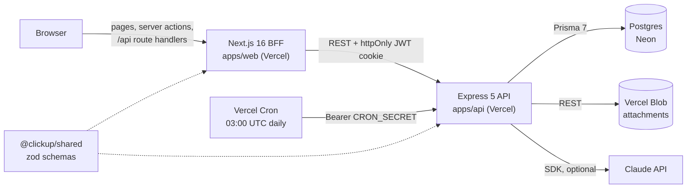

# ClickUp Clone: product source of truth

Last verified against `master` at `2a17de6` (2026-10-09). Every feature below was checked in code. Where the code and older docs disagree, this file follows the code.

- **Live demo:** https://click-up-clone-two.vercel.app (click **Continue as guest**)
- **Repo:** https://github.com/alysalah83/Click-up-clone
- **Built by:** one developer, as a flagship portfolio project

---

## 1. One-liners

**Pitch (1 sentence)**
A ClickUp-style project management app (tasks, eight views, sprints, docs, chat and dashboards) that you can try in one click in a pre-filled team workspace.

**Summary (3 sentences)**
ClickUp Clone is a full-stack work management app built as a TypeScript monorepo: Next.js 16 on the front, Express 5 + Prisma + Postgres behind it, and shared zod schemas between them. It covers the daily loop of a small team: plan in sprints, track work across Board, Table, Calendar, Timeline, Workload and Mind Map views, discuss in comments and chat, and measure progress on dashboards and goals. A guest click lands you in a seeded workspace with six teammates and about 110 tasks, so every feature has data to show.

---

## 2. The problem it solves

### For users

**Who:** small product and engineering teams, freelancers who manage several clients, and students running group projects.

| Pain | How the app addresses it |
|---|---|
| Tasks, docs and chat live in different tools | Tasks, nested docs, whiteboards and chat channels sit in the same spaces; chat messages and whiteboard sticky notes turn into tasks |
| No view of who is overloaded or what is late | Workload view with per-person capacity, overdue/today/upcoming buckets in My Work, dashboard cards for overdue and workload |
| Deadlines slip without warning | Timeline (Gantt) with "blocked by" dependencies, sprint burndown and velocity, goals that move as linked tasks finish |
| Repetitive admin | Automation rules, task templates, recurring tasks, public intake forms, CSV/Trello import |
| Tool sprawl | One app with eight views over the same tasks, Ctrl+K search across everything, an Inbox for mentions and assignments |

### For the portfolio

A recruiter has about two minutes. Most portfolio apps open on a sign-up form or an empty screen. Here, **Continue as guest** gives a private, pre-filled workspace in about two seconds: an active sprint board, teammates, comments, notifications, docs, goals and charts. The reviewer can judge a real full-stack SaaS without creating an account or reading code. The repo then backs it up with ADRs, tests and CI.

---

## 3. Feature catalog

All click paths start after **Continue as guest**, which opens the **Sprint 14** board (Product space). The left sidebar has Home, Inbox, Lists, DashBoard, Goals, Docs, Chat, Teams and Whiteboards. View tabs (Board, Table, List, Calendar, Timeline, Workload, Mind Map, Form, plus Sprint report on sprint lists) sit in the header of any list.

"Partial" marks features with known gaps.

### 3.1 Workspaces and teams

| Feature | What it does | Where to see it in the demo |
|---|---|---|
| Spaces and lists | Spaces (workspaces) hold lists; each list has its own statuses | Sidebar: **Product** (Sprints 11–15, Bug Tracker) and **Marketing** (Content Calendar, Q4 Launch Campaign) |
| Custom statuses | Per-list statuses typed open / active / done; add from the header | Any list → **Add Status** in the header |
| Members and roles | Owner, admin, member, guest; API checks membership on every request | Sidebar → **Teams** |
| Invite links | 7-day invite link, plus "Open as teammate" to test a second account in an incognito window | **Teams** → invite panel → **Open as teammate** |
| Assignees | Multiple assignees per task, avatars on cards and rows | Any board card; task panel → assignees |

### 3.2 Tasks

| Feature | What it does | Where to see it in the demo |
|---|---|---|
| Task panel | Split panel with title, status, priority, dates, assignees, points | Sprint 14 board → click **Add Google SSO to the login page** |
| Rich-text description | Tiptap editor (headings, lists, task lists) | Same task → description |
| Subtasks | Nested subtasks; Mind Map can add deeper levels | Same task → Subtasks section |
| Checklists | Multiple checklists with items | Task panel → Checklists |
| Tags | Colored, per-workspace tags | Task panel → Tags |
| Attachments | Drag-and-drop upload to Vercel Blob (4 MB max), image lightbox, download, delete | Task panel → Attachments (seeded files on some tasks) |
| Dependencies | "Blocked by" links between tasks | Task panel → Blocked by; arrows in Timeline |
| Activity log | Who changed what, per task | Task panel → Activity |
| Recurring tasks | Repeat daily/weekly/monthly; completing spawns the next occurrence with checklists (unchecked) and subtasks | Task panel → **Repeat**; repeat icon on rows in List/Table |
| AI: summarize, generate subtasks | Claude Haiku summarizes the task and comments, or suggests subtasks to add (20 calls/hour per user) | Task panel → **Summarize** / **Generate subtasks**. Partial: the buttons always show; if `ANTHROPIC_API_KEY` is not set on the API, clicking shows "AI is not configured on this server." |

### 3.3 Views

All views read the same tasks.

| View | What it does | Where to see it in the demo |
|---|---|---|
| Board | Drag cards across status columns; swimlanes by assignee or priority; per-column WIP limits | Landing page. "in progress" is over its WIP limit on purpose. **Swimlanes** in the toolbar |
| List | Grouped rows that open the task panel | **List** tab |
| Table | Spreadsheet rows, custom field columns, bulk edit (select rows → set priority) | **Table** tab → tick a row checkbox → priority button |
| Calendar | Month and week, drag to reschedule; compact grid + day list on phones | **Calendar** tab |
| Timeline (Gantt) | Bars you drag or resize, dependency arrows (click an arrow to remove it) | **Timeline** tab |
| Workload | Tasks or points per person by day or week, per-member capacity, overloads in red, drag to reassign | **Workload** tab on Sprint 14 (Maya Chen is overloaded) |
| Mind Map | Zoomable tree: list → statuses → tasks → subtasks; "+" on a node creates a subtask | **Mind Map** tab |
| Form | Form builder for the list (see 3.7) | Bug Tracker → **Form** tab |
| Sprint report | Burndown and velocity for sprint lists | Sprint 14 → **Sprint report** tab |
| Lists overview | All lists with task counts and an Import button | Sidebar → **Lists** |

### 3.4 Planning

| Feature | What it does | Where to see it in the demo |
|---|---|---|
| Sprints | Sprint lists with dates and points; **Complete sprint** carries unfinished work to the next sprint | Sprint 14 → sprint bar at the top. Partial: burndown has no scope-change line |
| Goals / OKRs | Number, currency, true/false and task-linked targets; progress updates as linked tasks finish | Sidebar → **Goals** → "Launch v2.0 by end of Q4". Partial: target name/value not editable after creation |
| Timeline + dependencies | Gantt with "blocked by" arrows | Sprint 14 → **Timeline** |
| Workload + capacity | Per-person capacity, red overloads | Sprint 14 → **Workload** → capacity popover. Partial: weekends use the same capacity |

### 3.5 Collaboration

| Feature | What it does | Where to see it in the demo |
|---|---|---|
| Comments | Threaded replies, @mentions, emoji reactions | Task panel → Comments (seeded threads) |
| Inbox | Mentions, assignments and status changes; unread badge; mark read / mark all | Sidebar → **Inbox** (badge on the sidebar item) |
| Chat | Channels per space, @mentions to Inbox, threads, reactions, **Turn into task** | Sidebar → **Chat** → **#product** |
| Activity | Per-task activity feed | Task panel → Activity |
| Updates | Polling with TanStack Query (inbox and comments every 30 s, chat messages every few seconds); no WebSockets | Leave the Inbox open; new items appear on the next poll |

### 3.6 Knowledge

| Feature | What it does | Where to see it in the demo |
|---|---|---|
| Docs | Nested pages per space, Tiptap editor with autosave, sidebar tree | Sidebar → **Docs** → "Product roadmap Q4" |
| Whiteboards | Excalidraw boards saved per space; a sticky note converts to a task | Sidebar → **Whiteboards** → "Q4 Product Brainstorm" → select a sticky note → convert. Partial: last save wins |

### 3.7 Automation and intake

| Feature | What it does | Where to see it in the demo |
|---|---|---|
| Automations | Per-list rules: trigger (status changed, task created) → up to 5 actions (notify assignees, assign user, set priority, set status). No conditions step | Sprint 14 → **Automations** in the header (2 seeded rules) |
| Task templates | Save a task with subtasks, checklists and tags as a template; use it from the add-task row | Ctrl+K → "Templates", or the template picker on Board/List add rows (Bug report, Feature, Meeting notes). Partial: template contents not editable |
| Recurring tasks | See 3.2 | Task panel → Repeat |
| Public forms | Public `/forms/<slug>` link, no login; each submission creates a task; rate-limited | Bug Tracker → **Form** tab → open the public link ("Report a bug") |
| Import | CSV (column mapping, preview) or Trello JSON into a new list; sample files bundled | Sidebar → **Lists** → **Import**, or a space menu → "Import (CSV / Trello)" |
| Share links | Public read-only links for lists and docs; reset to revoke | Marketing → Q4 Launch Campaign → share button in the header; Docs → "Q4 launch plan" → share |

### 3.8 Insights

| Feature | What it does | Where to see it in the demo |
|---|---|---|
| Dashboard | Metrics, workload chart, overdue, completed this week, burndown, time tracked per member (fixed layout, not configurable) | Sidebar → **DashBoard** |
| Burndown | Sprint and dashboard burndown charts | DashBoard; Sprint 14 → **Sprint report** |
| Velocity | Points completed per sprint (Sprints 11–14 seeded) | Sprint 14 → **Sprint report** |
| Time tracking | Live timer and manual entries per task; one running timer per user | Task panel → time tracking → **start timer**; totals on DashBoard |

### 3.9 Productivity

| Feature | What it does | Where to see it in the demo |
|---|---|---|
| Ctrl+K command palette | Search tasks, lists, docs, members, plus "Go to" pages (case-insensitive text match, not full-text search) | Press **Ctrl+K** (or the search button) |
| Filters, group by, sort | Toolbar filters, group by on List/Board, sort menu | Any list → View filters toolbar |
| Saved views | Named view configs per list with a default | Sprint 14 → **Saved views** → "By assignee" or "Urgent this week, by person" |
| Custom fields | 8 types: text, number, date, checkbox, dropdown, people, progress, formula. Table columns, task panel, filter and sort | Sprint 14 → **Table** → field columns (Severity, Effort score, ...) → "+" to add a field. Partial: values are not copied by recurrence, templates or sprint carry-over |
| Formula fields | Safe expression parser (no `eval`): `+ - * /`, parentheses, `points`, other number/progress fields by name | Sprint 14 → Table → "Effort score" (`points * 2 + {Estimate (h)}`) |
| My Work | Tasks assigned to me in Overdue, Today, Upcoming, No date; inline status/priority | Sidebar → **Home** |

### 3.10 Platform

| Feature | What it does | Where to see it in the demo |
|---|---|---|
| One-click guest demo | Claims a pre-seeded guest from a pool; dates shifted to today | Landing or login page → **Continue as guest** |
| Accounts | Email sign-up and login (bcrypt, httpOnly JWT cookie) | `/signup`, `/login` |
| Mobile layout | Sidebar drawer, snap-scroll board, compact calendar, capped modals | Open the demo on a phone (or a 390px window) |
| Light and dark themes | Theme toggle in the header, persisted | Header → theme button |
| Keyboard and a11y | Radix menus/dialogs with focus trap, Escape, focus return; Ctrl+K; arrow keys in the palette | Open any menu or the task panel and use the keyboard |
| Landing page | Hero, view tabs with real screenshots (dark/light), feature grid | https://click-up-clone-two.vercel.app (signed out) |

---

## 4. What makes it different: engineering highlights

Each item was checked in code. Paths are relative to the repo root.

1. **Monorepo with shared schemas.** pnpm + Turborepo: `apps/web`, `apps/api`, `packages/shared`. Request schemas (zod) live in `@clickup/shared`, so web and API validation cannot drift. The formula parser and import parser are shared too (`packages/shared/src/formula.ts`, `importParse.ts`). See ADR 0001.
2. **Layered API with membership-based authorization.** Routes → `validate()` (zod, unknown keys stripped) → controllers → services. Every referenced ID goes through `assertCanAccess()` (`apps/api/src/services/access.service.ts`), which checks workspace membership and role and returns 404 for both missing and foreign rows. See ADR 0003.
3. **Cross-account tests.** API integration tests run against a real Postgres (embedded locally, a service container in CI). 22 of 33 API test files include "another user" or non-member cases.
4. **Migrations applied on deploy.** The API's `vercel-build` runs `scripts/migrate-on-deploy.mjs`: production builds run `prisma migrate deploy` against Neon's direct host, with a baseline for pre-history migrations.
5. **Instant guest demo.** `guestPool.service.ts` keeps a small pool (default 3) of pre-seeded guests. A claim is one raw SQL statement with `FOR UPDATE SKIP LOCKED`, followed by 20 `UPDATE`s that shift seeded dates (tasks, sprints, comments, docs, chat, goals, ...) to "now". The pool refills after the response via the request context's `waitUntil`. `POOL_SEED_VERSION` (now 13) ensures only guests of the current seed are claimed.
6. **Daily guest cleanup, blobs included.** Vercel Cron calls `/internal/cron/cleanup-guests` at 03:00 UTC, guarded by a constant-time `CRON_SECRET` check. It deletes guests older than 7 days and their uploaded Vercel Blob files.
7. **Rate limiting built for a BFF.** Every API request arrives from the Next.js server with the same IP, so limits are keyed by email (login, register), globally (guest sign-up), or by form slug / share token plus a forwarded client IP (public forms and share pages). AI calls have their own per-user hourly limit.
8. **Next.js as a BFF.** The browser only talks to Next.js: server actions (29 files) and 70 route handlers under `apps/web/src/app/api` forward to Express with the httpOnly JWT cookie. The browser axios client has no API base URL. Only the API touches the database.
9. **Accessibility migration behind stable APIs.** The v1 hand-built Menu, Modal, ToolTip and toasts were rebuilt on Radix (shadcn/ui) with the same exports and props, so about 60 call sites did not change. The original code stays as a showcase in `apps/web/src/legacy-ui` (route `/legacy-ui`, dev only). See ADR 0002.
10. **Polling instead of WebSockets.** Inbox, comments and chat use TanStack Query `refetchInterval` (chat pauses in background tabs). This keeps hosting on free serverless tiers.
11. **E2E in CI.** GitHub Actions runs lint, typecheck, unit/integration tests and build with Postgres 17, then a second job runs Playwright against production builds and uploads the report on failure. The E2E test walks the guest path: seeded board, drag a card, open/close the task panel, bulk-set priority in Table, Calendar, sign out.
12. **Free-tier infrastructure only.** Vercel (web and API), Neon Postgres, Vercel Blob (called through its REST API, no SDK), Vercel Cron. No credit card.
13. **Cold-start mitigation.** The login page pings `/api/warmup`, which wakes the serverless API and Neon in the background before the user clicks.
14. **Modern React setup.** React Compiler and Next.js `cacheComponents` are enabled (`apps/web/next.config.*`).
15. **Deterministic, realistic seed.** 17 seed modules (`apps/api/src/seed/`) with stable keys and a seeded PRNG: sprints with history for velocity, an overloaded teammate for Workload, WIP limits already exceeded, comments, chat, docs, goals, forms, share links.

---

## 5. Tech stack

Versions are the ranges in each `package.json`.

| Layer | Technology |
|---|---|
| **Frontend** | Next.js ^16.1.6 (App Router, React Compiler), React ^19.2.4, TypeScript ^5, Tailwind CSS ^4, shadcn/ui on radix-ui ^1.6.7, TanStack Query ^5.83, Zustand ^5.0.5, React Hook Form ^7.71 + zod ^4, dnd-kit core ^6.3.1, Tiptap ^3.31, Recharts ^3.1, Excalidraw ^0.18, cmdk ^1.1.1, date-fns ^4.1, sonner ^2.0.8, next-themes ^0.4.6, motion ^12.38 |
| **Backend** | Node 22+, Express ^5.1.0, Prisma ^7 (client ^7.4.2, Neon adapter ^7.5.0), zod ^4.6.5, jsonwebtoken ^9, bcrypt ^6, helmet ^8.3, express-rate-limit ^8.7, @anthropic-ai/sdk ^0.129 (Claude Haiku 4.5) |
| **Shared** | `@clickup/shared`: zod ^4 schemas, formula evaluator, import parser |
| **Data** | PostgreSQL on Neon (Postgres 17 in CI), Vercel Blob for attachments |
| **Infra** | Vercel (two projects: web and API), Vercel Cron, GitHub Actions, pnpm 10.33 + Turborepo ^2.5 |
| **Testing** | Vitest ^4 (web, API, shared), Testing Library (React ^16.3), jsdom, Supertest ^7.3 + embedded-postgres (API), Playwright ^1.63 (E2E) |

---

## 6. Architecture



```
apps/web          Next.js 16 app: src/app (routes, 70 BFF route handlers), src/features (28 feature folders),
                  src/shared (layout, ui facades on Radix), src/legacy-ui (v1 library showcase), e2e/ (Playwright)
apps/api          Express 5: routes → validate() → controllers → services; prisma/schema.prisma;
                  src/seed (demo workspace); scripts/migrate-on-deploy.mjs; test/ (Vitest + Postgres)
packages/shared   zod schemas and pure helpers used by both apps
docs/             HANDOFF, roadmap, ADRs 0001–0003, this file
assets/           README screenshots and demo GIF
```

---

## 7. By the numbers

Measured on `master` at `2a17de6`.

| Metric | Count | How measured |
|---|---|---|
| Features in this catalog | 58 | Rows in the section 3 tables (a few, like recurring tasks, appear in two areas) |
| Task views | 8 (+ Sprint report, Lists overview) | Header view tabs in `Header.const.ts` |
| Web pages | 32 | `page.tsx` files under `apps/web/src/app` |
| BFF route handlers | 70 | `route.ts` files under `apps/web/src/app/api` |
| API route files | 28 | `apps/api/src/routes/*.routes.ts` |
| API endpoints | 152 | Script count of `router.<method>("path"` registrations in `apps/api/src/routes`: 52 GET, 47 POST, 23 PATCH, 4 PUT, 26 DELETE (includes the cron route; excludes `/health` in `app.ts`) |
| API services | 33 | `*.service.ts` files in `apps/api/src/services` |
| Prisma models | 38 | `^model ` in `schema.prisma` |
| Web feature folders | 28 | `apps/web/src/features/*` |
| Seeded demo data | 2 spaces, 8 lists, ~110 top-level tasks, 6 teammates, 8 docs, 2 whiteboards, 3 goals, 2 chat channels, 3 templates | Seed helper calls in `apps/api/src/seed/*.ts` |
| Test files / tests: web | 38 files / 179 tests (+1 Playwright E2E) | `*.test.ts(x)` files; lines starting with `it(` or `test(` |
| Test files / tests: API | 33 / 168 | Same method |
| Test files / tests: shared | 9 / 71 | Same method |
| Total | 81 files, ~419 tests | Sum; `it.each` rows count once |
| Commits | 239 (127 since 2026-09-01) | `git log --oneline \| wc -l`; history starts 2025-08-02 (v1 repos merged in) |

---

## 8. Ready-to-use copy

### (a) GitHub "About"

> ClickUp-style project management SaaS: 8 views, sprints, docs, chat, dashboards. Next.js 16, Express, Prisma, Postgres.

(115 characters)

**Topics:** `nextjs` `react` `typescript` `express` `prisma` `postgresql` `neon` `tailwindcss` `shadcn-ui` `radix-ui` `tanstack-query` `turborepo` `pnpm` `monorepo` `zod` `playwright` `vitest` `vercel` `project-management` `kanban` `gantt` `clickup-clone` `full-stack` `saas`

### (b) Portfolio card

**Short (~40 words)**
A ClickUp-style project management app with Board, Table, Calendar, Timeline, Workload and Mind Map views, sprints, goals, docs, chat and dashboards. One click opens a seeded team workspace. Next.js 16, Express 5, Prisma, Postgres, in a typed monorepo.

**Long (~120 words)**
A full-stack, ClickUp-style work management app I built and run on free infrastructure. Teams plan in sprints, track tasks across eight views (Board with swimlanes and WIP limits, Table with formula fields, Calendar, Gantt Timeline with dependencies, Workload, Mind Map, List, Form), discuss in threaded comments and chat, and measure progress with burndown, velocity, goals and time tracking. Docs, whiteboards, automations, templates, public forms, share links and CSV/Trello import round it out. The live demo claims a pre-seeded guest in about two seconds. Under the hood: a pnpm + Turborepo monorepo with shared zod schemas, a Next.js BFF in front of a layered Express 5 + Prisma API with membership checks, migrations on deploy, ~420 tests and Playwright E2E in CI.

### (c) CV bullet

> Built and deployed a ClickUp-style project management SaaS (Next.js 16, Express 5, Prisma, Postgres; 38 models, 152 endpoints, ~420 tests) with a one-click seeded demo that loads in ~2 s via a pre-seeded guest pool, on free-tier Vercel and Neon.

### (d) Suggested README order

1. Title, one-line pitch, CI badge
2. **Try the live demo** link + demo GIF
3. Screenshot grid (6–8 best, rest behind a `<details>`)
4. Features (grouped, short)
5. Architecture (diagram + monorepo layout)
6. Engineering highlights (link ADRs)
7. Tech stack
8. Local development and checks
9. Project evolution (v1 → v3)
10. Limitations and roadmap
11. Link to `docs/PRODUCT.md`

---

## 9. Screenshot shot list

Default setup: desktop 1440×900, device scale 2, dark theme, fresh guest login. `apps/web/scripts/capture-screenshots.mjs` automates most of these.

| # | Shot | URL / path | State to set up | Caption | Existing image |
|---|---|---|---|---|---|
| 1 | Sprint board | `/home/lists/<Sprint 14>/board` | Landing after guest login, dark | "Sprint board with custom statuses and a WIP limit warning" | `assets/screenshots/board.png`, `public/landing/board-*.webp` |
| 2 | Task panel | same, panel open | Click **Add Google SSO to the login page** | "Task panel: rich text, subtasks, checklists, tags, comments, AI" | `assets/screenshots/task-panel.png`, `public/landing/task-*.webp` |
| 3 | Timeline | `.../timeline` | Scroll so dependency arrows are visible | "Gantt timeline with drag-to-reschedule and dependencies" | `assets/screenshots/timeline.png`, `public/landing/timeline-*.webp` |
| 4 | Table with custom fields | `.../table` | Scroll right to Severity, Effort score (formula), Progress; tick 2 rows | "Table: custom fields, formulas and bulk edit" | `assets/screenshots/table.png` |
| 5 | Workload | `.../workload` | Week mode, Maya Chen's red overload visible | "Workload: capacity per person, overloads in red" | `assets/screenshots/workload.png`, `public/landing/workload-*.webp` |
| 6 | Dashboard | `/home/dashboard` | Default | "Dashboard: workload, overdue, burndown, time tracked" | `assets/screenshots/dashboard.png`, `public/landing/dashboard-*.webp` |
| 7 | Sprint report | `.../sprint` | Default | "Sprint burndown and velocity across Sprints 11–14" | `assets/screenshots/sprint.png` |
| 8 | Chat | `/home/chat/<#product>` | Open a thread on a message | "Chat channels with threads, mentions and message-to-task" | `assets/screenshots/chat.png`, `public/landing/chat-*.webp` |
| 9 | Docs | `/home/docs/<Product roadmap Q4>` | Sidebar tree expanded | "Nested docs with autosave" | `assets/screenshots/docs.png` |
| 10 | Mind Map | `.../mindmap` | Zoom to fit, one task expanded to subtasks | "Mind map: list → statuses → tasks → subtasks" | `assets/screenshots/mindmap.png`, `public/landing/mindmap-*.webp` |
| 11 | Light theme board | `.../board` | Light theme via header toggle | "Light theme" | `assets/screenshots/board-light.png`, `public/landing/*-light.webp` |
| 12 | Phone pair | `.../board` and `.../calendar` at 390×844 | Mobile emulation | "Phone layout: drawer, snap-scroll board, compact calendar" | `assets/screenshots/mobile-board.png`, `mobile-calendar.png` |

Also in the repo and not in the top 12: `list.png`, `calendar.png`, `my-work.png`, `inbox.png`, `teams.png`, `goals.png`, `whiteboard.png`, `form.png`, `assets/demo.gif`, and `apps/web/src/app/opengraph-image.png` / `twitter-image.png`.

**Gaps (no image yet):** Ctrl+K palette, Automations dialog, Import wizard, public share page `/share/<token>`, Board swimlanes. A Ctrl+K shot and a swimlane board would be the most useful additions.

---

## 10. Honest limitations and roadmap

### Intentionally not built

| Not built | Why |
|---|---|
| Real-time co-editing, presence, live cursors | Needs WebSockets or a paid realtime service; the project stays on free serverless hosting. Polling covers inbox, comments and chat. Docs and whiteboards are last-save-wins |
| AI without a key | AI calls cost money. The buttons always render, but without `ANTHROPIC_API_KEY` on the API they show "AI is not configured on this server." Whether the live API has a key set could not be confirmed from the repo |
| Integrations (Slack, GitHub, email, calendar sync) | Out of scope for a solo portfolio piece; import covers CSV and Trello files only |
| SSO and billing | No enterprise auth or payments; email/password and guest only. Stripe test mode is a roadmap idea |
| Email notifications and email invites | Inbox is in-app; invites are links |
| Configurable dashboards, automation conditions | Dashboard layout is fixed; automations are trigger → actions without conditions |
| Full-text search | Ctrl+K uses case-insensitive substring matching, not Postgres full-text |

### Known gaps (from code and handoff notes)

- Custom field values are not copied by recurrence, templates or sprint carry-over.
- Burndown has no scope-change line; workload capacity ignores weekends.
- Goal targets and template contents cannot be edited after creation.
- Deleting a list or space does not delete its attachment blobs (guest cleanup does).
- Rate limits use an in-memory store per serverless instance.
- Local `next dev` currently returns 500 because of a dynamic route slug conflict (`api/workspaces/[id]/...` next to `[workspaceId]/...`); production is unaffected.
- README says "~80 tasks"; the seed now has about 110 top-level tasks.

### Roadmap (from `docs/roadmap.md`)

- Realtime once a free option fits (e.g. Cloudflare Durable Objects).
- "Ask your workspace" AI, email invites, Stripe test-mode billing.
- Virtualized lists for 10k tasks, more keyboard shortcuts.
